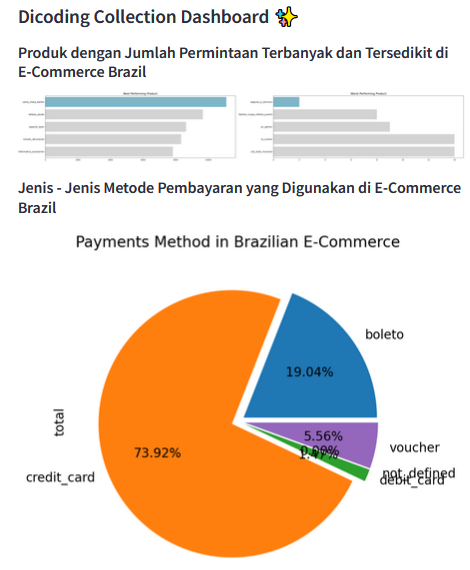

# Dicoding Collection Dashboard ✨

# Setup environment
```
conda create --name main-ds python=3.9
conda activate main-ds
pip install numpy pandas matplotlib seaborn streamlit
```

## Run Streamlit app
```
streamlit run Brazil.py
```

## Online Dasboard web
See online dashboard web below

[**Dicoding Collection Dashboard**](https://dicoding-sslxp48quqxjvzyehzmbts.streamlit.app/)


